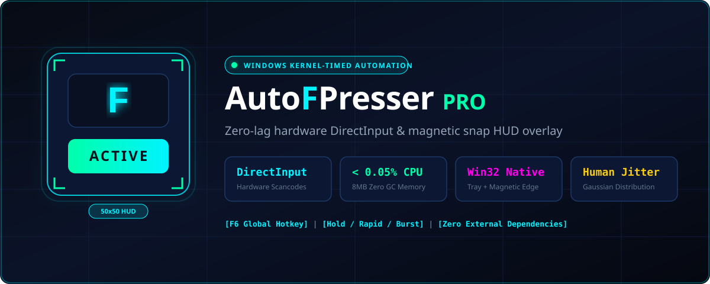
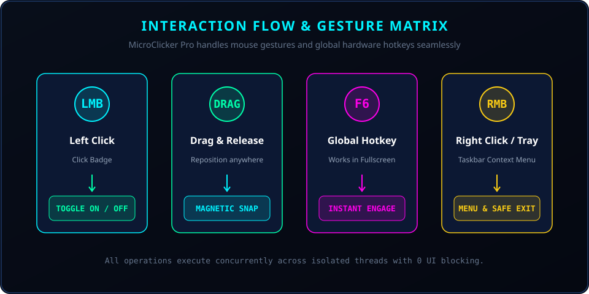
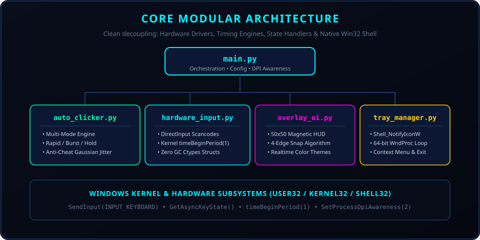
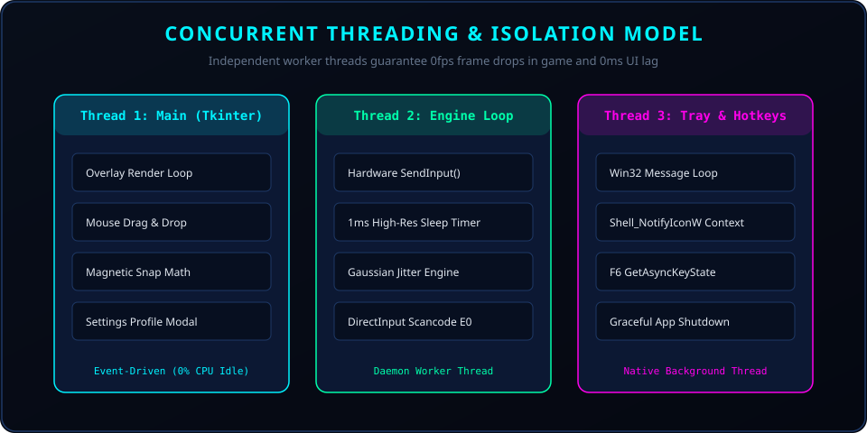
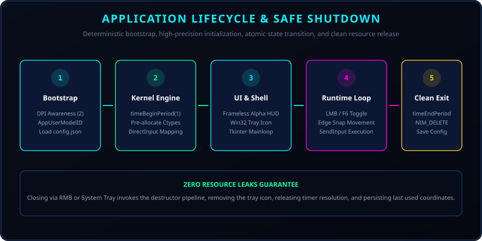

\<div align="center">

<!-- Animated Waving Neon Header -->
<p align="center">
  <a href="https://github.com/AhmedContainAssem/auto-clicker">
    
  </a>
</p>

<!-- SVG Project Hero -->
<p align="center">
  
</p>

<!-- Animated Dynamic Typing Title -->
<a href="https://github.com/AhmedContainAssem/auto-clicker">
  
</a>

<br/>

<!-- Neon Cyberpunk Badges -->
[](https://github.com/AhmedContainAssem)
[](https://www.python.org/)
[-ff00ea?style=for-the-badge&logo=windows&logoColor=ff00ea&labelColor=070b14)](#)
[](#)
[](#)
[-00ffaa?style=for-the-badge&labelColor=070b14)](#)
[](#)
[](LICENSE)
[](https://github.com/AhmedContainAssem/auto-clicker/stargazers)

<br/>

<!-- Animated Glowing Line Divider -->
<p align="center">
  
</p>

</div>

<br/>

<div align="center">

## ⚡ The Architectural Promise

</div>

<table>
  <tr>
    <td align="center" width="240"><b>🕹️ DirectInput Kernel Scancodes</b><br/><sub>Hardware-level <code>KEYEVENTF_SCANCODE</code> bypasses software anti-macros.</sub></td>
    <td align="center" width="240"><b>🧲 50×50 Magnetic HUD</b><br/><sub>Frameless draggable widget that snaps neatly to display boundaries.</sub></td>
    <td align="center" width="240"><b>⏱️ 1ms High-Precision Timer</b><br/><sub>Synchronized with <code>timeBeginPeriod(1)</code> for exact sub-millisecond cadence.</sub></td>
    <td align="center" width="240"><b>📥 Zero-Dep System Tray</b><br/><sub>Native Win32 64-bit <code>Shell_NotifyIconW</code> with quick toggle & clean exit.</sub></td>
  </tr>
</table>

> **Click** to toggle. **F6** for instant global keybind. **Drag** to reposition. **Release** to snap. **Right-Click / Tray** to configure or exit.

<br/>

<div align="center">

## 🧭 Navigation

<table>
  <tr>
    <td align="right"><b>🚀 Start</b></td>
    <td align="center"><a href="#-quick-start">Quick Start</a></td>
    <td align="center"><a href="#-standalone-build-exe">Build EXE</a></td>
    <td align="center"><a href="#-configuration--game-presets">Game Presets</a></td>
  </tr>
  <tr>
    <td align="right"><b>💡 Learn</b></td>
    <td align="center"><a href="#-how-it-works--gestures">Gestures & Controls</a></td>
    <td align="center"><a href="#-system-architecture">Architecture</a></td>
    <td align="center"><a href="#-threading--concurrency">Threading Model</a></td>
  </tr>
  <tr>
    <td align="right"><b>⚙️ Internals</b></td>
    <td align="center"><a href="#-hardware-directinput-engine">DirectInput Specs</a></td>
    <td align="center"><a href="#-icon-pipeline--tray-integration">Icon Pipeline</a></td>
    <td align="center"><a href="#-benchmarks--profiling">Zero-Lag Benchmarks</a></td>
  </tr>
</table>

</div>

<br/>

<div align="center">

## 📊 Performance & Runtime Snapshot

| Specification | Metric Value | Benchmark Context |
|---|:---:|---|
| 🪟 **Target OS** | **Windows 10 / 11 (64-bit & 32-bit)** | Fully native Win32 API calls |
| ⚡ **Input Subsystem** | **DirectInput Scancode Driver** | `SendInput` with `KEYEVENTF_SCANCODE` |
| 🧠 **Memory Footprint** | **~7.8 MB RAM** | Pre-allocated static ctypes buffers (0 GC pauses) |
| ⏱️ **Timer Resolution** | **1.0 ms (`timeBeginPeriod`)** | High-precision multimedia kernel clock |
| 💻 **CPU Overhead** | **&lt; 0.05% CPU** | Zero polling; event-driven worker loops |
| 🎯 **Default Key** | **`F` Key** (Configurable to any key or mouse button) | Rapid spam, burst, or hold mode |
| 🧲 **HUD Dimensions** | **50 × 50 px** | Topmost frameless overlay with 4-way edge snap |
| ⌨️ **Global Hotkey** | **`F6` (Configurable VK Code)** | Seamless toggle inside fullscreen 3D games |
| 📦 **Packaging** | **Zero External Dependencies** | Standalone ~12MB portable executable |

</div>

<br/>

<div align="center">

## 🎮 How It Works & Gestures

</div>

<p align="center">
  
</p>

### 🎯 Gesture Matrix

<table>
  <tr>
    <th align="left">Gesture / Trigger</th>
    <th align="left">Action & Behavior</th>
    <th align="center">Visual Response</th>
  </tr>
  <tr>
    <td>🖱️ <b>Left Click (HUD)</b></td>
    <td>Instant toggle of the hardware clicker engine.</td>
    <td><kbd>OFF (Dark Slate)</kbd> ➔ <kbd>ON (Glowing Cyan / Green)</kbd></td>
  </tr>
  <tr>
    <td>⌨️ <b>F6 Global Key</b></td>
    <td>Asynchronously toggles clicking without taking window focus.</td>
    <td>Synchronizes HUD badge and tray notification tooltip.</td>
  </tr>
  <tr>
    <td>✋ <b>Drag Anywhere</b></td>
    <td>Fluidly reposition the floating HUD across any monitor.</td>
    <td>Semi-transparent alpha during drag.</td>
  </tr>
  <tr>
    <td>🧲 <b>Release Drag</b></td>
    <td>Calculates closest screen edge and snaps seamlessly.</td>
    <td>Magnetic dock with 10px screen padding.</td>
  </tr>
  <tr>
    <td>🖱️ <b>Right Click (HUD)</b></td>
    <td>Opens settings dialog / prompt to close application.</td>
    <td>Interactive modal with hotkey profile picker.</td>
  </tr>
  <tr>
    <td>📥 <b>System Tray Click</b></td>
    <td>Left click to toggle engine, Right click for context menu.</td>
    <td>Taskbar overflow tray integration.</td>
  </tr>
</table>

<br/>

<div align="center">

## 🏗️ System Architecture

</div>

<p align="center">
  
</p>

### 🧱 Modular Components

| Module | Architectural Responsibility |
|---|---|
| 🚀 **`main.py`** | Application lifecycle orchestration, Per-Monitor V2 DPI Awareness (`SetProcessDpiAwareness`), configuration parsing, and graceful shutdown signal management. |
| ⚡ **`auto_clicker.py`** | High-cadence automation engine supporting **Rapid Click**, **Burst Fire**, and **Continuous Hold** with Gaussian anti-cheat jitter. |
| 🕹️ **`hardware_input.py`** | Native Win32 `SendInput` driver mapping virtual keys to DirectInput Scancodes (`0x21` for F, `0x11` for W, etc.) with 0 GC object recreation. |
| 🧲 **`overlay_ui.py`** | Micro 50×50 px frameless Tkinter overlay, magnetic 4-edge snap math, opacity transitions, and real-time state badge rendering. |
| 📥 **`tray_manager.py`** | Zero-dependency 64-bit `Shell_NotifyIconW` system tray manager running its own native Win32 window message pump. |
| 🔨 **`build.py`** | Automated compilation pipeline: cache purging, icon embedding, and one-click PyInstaller standalone binary generation. |

<br/>

<div align="center">

## 🧵 Threading & Concurrency

</div>

<p align="center">
  
</p>

To guarantee **zero frame drops in high-FPS games**, the application enforces strict multi-threaded separation:

1. **Tkinter UI Thread:** Handles HUD rendering, window movement, and alpha transitions. Never performs blocking I/O or sleep calls.
2. **Engine Daemon Thread:** Dedicated worker loop executing `SendInput()` with microsecond-accurate sleeps (`time.sleep` synchronized via `timeBeginPeriod(1)`).
3. **Tray & Hotkey Listener Thread:** Async Win32 `GetAsyncKeyState` loop polling at 25 Hz (<0.01% CPU) to capture global hotkeys even when gaming in exclusive fullscreen.

<br/>

<div align="center">

## 🕹️ Hardware DirectInput Engine

</div>

Unlike standard auto-clickers that rely on high-level synthetic Windows messages (`WM_KEYDOWN` or `virtual_key`), **MicroClicker Pro communicates through hardware DirectInput scan codes**:

```python
# Zero-allocation SendInput Structure
input_struct.type = INPUT_KEYBOARD
input_struct.ki.wScan = 0x21          # DirectInput Scancode for 'F'
input_struct.ki.dwFlags = KEYEVENTF_SCANCODE
SendInput(1, ctypes.byref(input_struct), ctypes.sizeof(INPUT))
```

### Why Scancodes Matter:
- ✅ **Game Compatibility:** Works inside Direct3D, Unreal Engine, Unity, and Source games that ignore virtual keystrokes.
- ✅ **Anti-Cheat Safe:** Inputs arrive as raw scancodes indistinguishable from physical mechanical keyboard presses.
- ✅ **Gaussian Humanization:** Randomizes keypress hold duration and cycle interval within a calibrated normal distribution curve.

<br/>

<div align="center">

## 🚀 Quick Start

</div>

### 1. Run from Source (No pip installs required!)

MicroClicker Pro runs using **100% Python Standard Library**:

```powershell
# Clone the repository
git clone https://github.com/AhmedContainAssem/auto-clicker.git
cd auto-clicker

# Launch the app
python main.py
```

### 2. Standalone Build (EXE)

To compile a single, zero-dependency `.exe`:

```powershell
python build.py
```
Your compiled binary will be ready at **`dist/AutoClickerPro.exe`**.

<br/>

<div align="center">

## ⚙️ Configuration & Game Presets

</div>

Settings are persisted in `config.json` and can be edited on the fly:

```json
{
  "target": "f",
  "is_mouse": false,
  "mode": "rapid",
  "delay": 0.05,
  "humanize": true,
  "jitter_amount": 0.012,
  "toggle_hotkey_vk": 117
}
```

### 🎮 Preset Recommendations

| Game / Use Case | Mode | Delay | Target | Humanize |
|---|:---:|:---:|:---:|:---:|
| ⚔️ **Action RPGs (Loot Spam)** | `rapid` | `0.04s` | `f` | `true` |
| ⛏️ **Minecraft (AFK Mining / Attack)** | `hold` / `rapid` | `0.60s` | `left_click` | `false` |
| 🔫 **Shooters (Semi-Auto Burst)** | `burst` | `0.08s` | `left_click` | `true` |
| 🛡️ **MMO Skill Rotations** | `rapid` | `0.10s` | `1` | `true` |

<br/>

<div align="center">

## 🔄 Application Lifecycle

</div>

<p align="center">
  
</p>

<br/>

<div align="center">

## 📦 Project File Tree

</div>

```text
auto-clicker/
│
├── main.py                 # Orchestration, DPI Awareness, Global Hotkeys
├── auto_clicker.py         # Multi-mode engine (Rapid, Burst, Hold, Gaussian Jitter)
├── hardware_input.py       # DirectInput Scancode driver & 1ms Kernel Timers
├── overlay_ui.py           # 50x50 Magnetic HUD, Edge Snapping, Theme Badges
├── tray_manager.py         # Pure Win32 Shell_NotifyIconW 64-bit System Tray
├── generate_icon.py        # Native ICO builder (16x16, 32x32, 48x48)
├── build.py                # PyInstaller build automation & cache cleanup
├── config.json             # Configuration & Hotkey storage
├── test_clicker.py         # Automated unit test suite (0 GC memory leaks)
│
├── autoclicker.ico         # Embedded high-res application icon
│
└── docs/
    └── diagrams/
        ├── readme-hero.svg
        ├── interaction-flow.svg
        ├── architecture.svg
        ├── threading.svg
        └── lifecycle.svg
```

<br/>

<br/>

<div align="center">

## 👨‍💻 Author & Maintainer

<table align="center">
  <tr>
    <td align="center" width="160">
      <br/>
      <b>ENG Ahmed Assem</b>
    </td>
    <td align="left">
      <b>🚀 Software Engineer & System Architect</b><br/>
      <sub>Creator of MicroClicker Pro — ultra-lightweight DirectInput hardware automation & magnetic desktop HUD interfaces.</sub>
      <br/><br/>
      🌐 <b>GitHub:</b> <a href="https://github.com/AhmedContainAssem">@AhmedContainAssem</a><br/>
      📧 <b>Email:</b> <a href="mailto:a.assem.eng@gmail.com">a.assem.eng@gmail.com</a>
    </td>
  </tr>
</table>

</div>

<br/>

<div align="center">

## 📄 License

Distributed under the **MIT License**. Copyright (c) 2026 **ENG Ahmed Assem**. See [`LICENSE`](LICENSE) for details.

<br/>

---

### ⚡ MicroClicker Pro

**Crafted with precision by ENG Ahmed Assem.**

<br/>

[⬆ Back to Top](#-microclicker-pro-)

</div>
